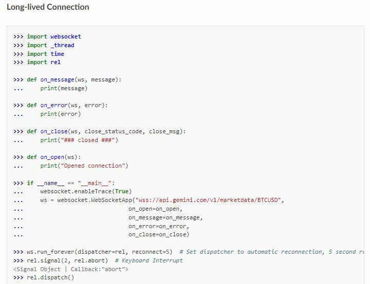
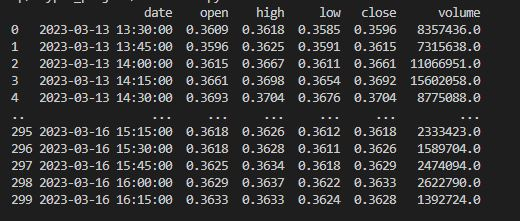
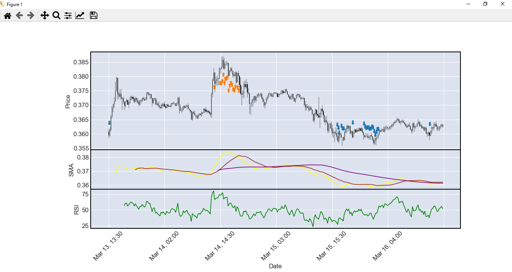
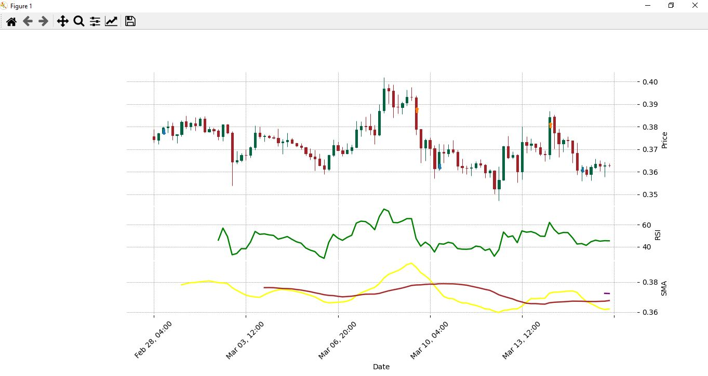
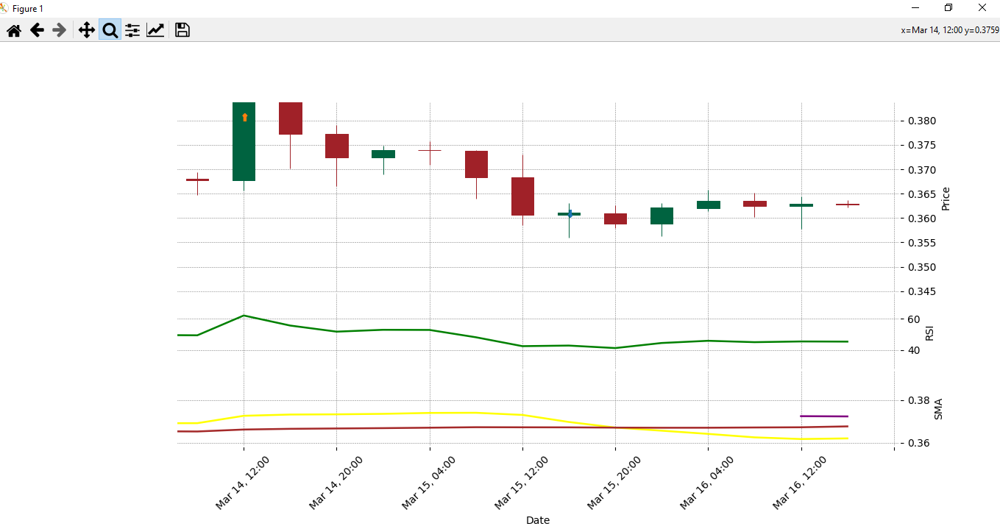

#### 1.The trading bot connects to the Binance API
#### 2.receive and extract new OHLCV (Open, High, Low, Close, Volume) data from message every second 
#### 3.stores it in a data frame and continuously update it with a new data
#### 4.calculates indicators such as Relative Strength Index (RSI) values, as well as Simple Moving Average (SMA).
#### 5.It considers buy and sell conditions in strategyBuy and strategySell functions respectively 
#### 6.places a buy or sell order if condition is true.

#### .The trading bot connects to the Binance API via Websocket long-lived connection

#### .Stores OHLCV data in the Pandas Dataframe and continuously updates it

#### .Calculates indicators such as Relative Strength Index (RSI) values, Simple Moving Average (SMA)
#### Display indicators on candlestick chart with marks where buy and sell conditions are True using mplfinance

#### .Place a buy or sell order if condition is true
#### Display the real trades on candlestick chart 

#### where marks shows the exact price and exact location of a trade

